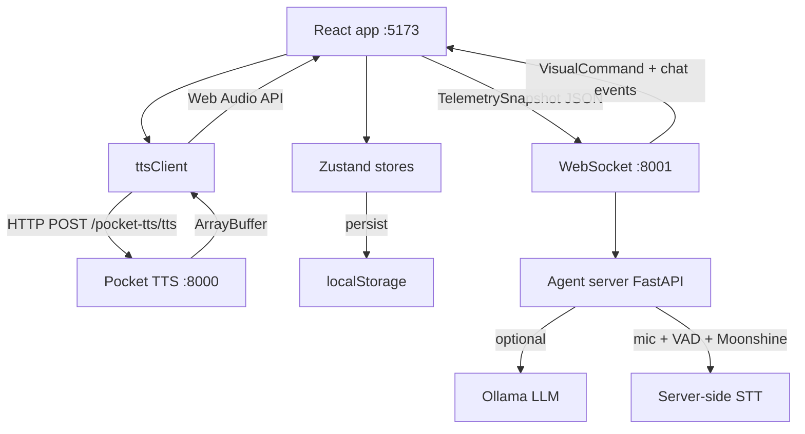
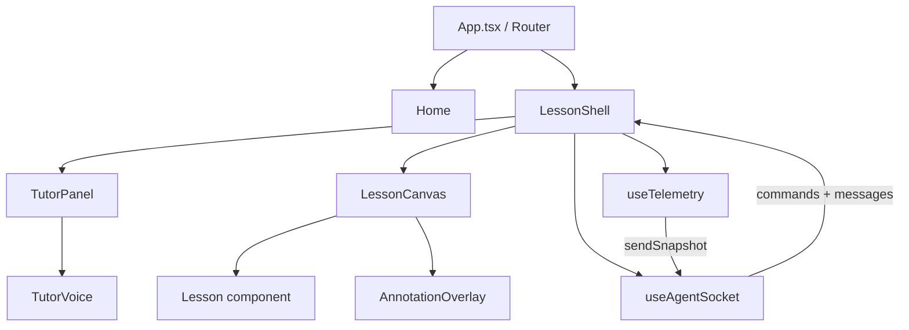

# Architecture — Math-TutorK

This document describes how the **React app**, **Pocket TTS**, and **Python agent server** fit together. It matches the current codebase (`src/`, `server/main.py`).

## 1. System overview



**Important distinction**

- **Browser** does not capture the microphone for STT. The **agent process** on the developer machine reads the default system microphone, runs VAD + STT, and may send `stt_result` and trigger LLM replies.
- **TTS playback** happens in the **browser** (fetched from Pocket TTS, decoded with Web Audio).

## 2. UI composition

The app uses a **Shell · Panel · Canvas** pattern for every lesson wrapped in `LessonShell`.



- **`LessonShell`** — Owns tutor voice (`useTutorVoice`), chat list, agent socket, telemetry, playbook-driven `teach` sequences, and `feedback` → short praise / hint flows.
- **`TutorPanel`** — Avatar, `TutorVoice`, **chat transcript**, **Send** input, **mic/STT mute** (tells server to ignore phrases), **speaker** (client TTS mute).
- **`LessonCanvas`** — Progress bar, score, connection dot, optional swap overlay, children = the lesson.

There are **40** routed lessons (see `src/App.tsx`).

## 3. Data flow

### 3.1 Adaptive difficulty (lesson-level)

Many lessons use **`useAdaptiveDifficulty`** + **`useDifficultyStore`** so problem generators see a **level 1–5** driven by a rolling accuracy window. Not every screen uses the same hook; some lessons fix their own numeric ranges.

### 3.2 Tutor voice (TTS + typewriter)

1. Callers use **`useTutorVoice`**: `speak`, `speakInstruction`, `offerHint`, `cancelSpeaking`, `setTtsMuted`, etc.
2. **`speakInstruction`** runs a **typewriter** on the bubble text and, unless **TTS is muted**, calls **`ttsClient.speakText`** (cache → HTTP → Web Audio).
3. **`cancelSpeaking`** (e.g. on **`barge_in`**) stops audio and timers so new speech can start cleanly.

### 3.3 Telemetry → agent

1. **`useTelemetry`** (inside `LessonShell`) listens for mouse moves, keys, tab focus, per-problem answer deletions, and combines **session** stats from **`useScoreStore`** + **level** from **`useDifficultyStore`**.
2. On a fixed interval (**default 3s**), it builds a **`TelemetrySnapshot`** (must include **`lessonId`**) and passes it to **`sendSnapshot`** from **`useAgentSocket`**.
3. The server runs a **rule engine** (`evaluate` in `server/main.py`) and may respond on the same WebSocket with a **`VisualCommand`** object (JSON).

### 3.4 Agent → UI (commands + chat)

| Direction | Message / payload | Role |
|-----------|-------------------|------|
| Server → client | `VisualCommand` (`annotate` \| `swap` \| `teach`) | Change canvas / run lesson playbook |
| Server → client | `stt_result` `{ text }` | Phrase from server mic (shown as student chat when wired) |
| Server → client | `tutor_reply` `{ text }` | LLM (or pipeline) reply — spoken + tutor chat line |
| Server → client | `barge_in` | Cancel in-flight work; frontend should **`cancelSpeaking`** |
| Client → server | `TelemetrySnapshot` (object with `lessonId`) | Telemetry tick |
| Client → server | `{ type: 'user_chat', text }` | Typed chat to tutor |
| Client → server | `{ type: 'set_child', name }` | Display name for prompts |
| Client → server | `{ type: 'set_stt_muted', muted }` | When `true`, server **drops** finished mic phrases (no STT / no LLM from voice) |

**`LessonShell`** maps commands roughly as:

- **`annotate`** — Sets `annotations` state → **`AnnotationOverlay`** (default **auto-hide 6s**).
- **`swap`** — Calls lesson **`onSwapView`** or shows internal swap overlay + optional `speech`.
- **`teach`** — Resolves a **`TeachingPlaybook`** by `strategy`, may speak `speech`, then plays **`AnnotationStep[]`** (delays + per-step `speech` awaited via `speakInstruction`).

### 3.5 VisualCommand shape (TypeScript)

Defined in **`src/types/visualCommand.ts`** (source of truth). Summary:

```typescript
type VisualCommand = {
  type: 'annotate' | 'swap' | 'teach'
  target?: string            // swap: view key
  actions?: Annotation[]     // annotate
  strategy?: string          // teach: playbook id
  speech?: string            // optional spoken line
}

interface Annotation {
  action: 'highlight' | 'circle' | 'pulse' | 'label' | 'animate_arrow'
  element: string            // selector scoped to lesson canvas where possible
  color?: string
  label?: string
  toElement?: string         // animate_arrow
}
```

### 3.6 Rule engine (illustrative)

Thresholds live in Python (`COOLDOWN_S`, `CONSECUTIVE_THRESHOLD`, etc.). The architecture doc cannot list every branch; see **`server/main.py`** and telemetry fields in **`TelemetrySnapshot`** for the exact signal names (`idleMs`, `tabFocused`, `answerDeletions`, `accuracy`, …).

## 4. State stores (Zustand)

| Store | Typical use |
|-------|-------------|
| **`useProgressStore`** | Per-lesson stars, attempts, completion |
| **`useDifficultyStore`** | Persisted level 1–5 + rolling window |
| **`useChildStore`** | Name, avatar, age band |
| **`useScoreStore`** | Session points, streak, correct/wrong counts (feeds telemetry accuracy) |

## 5. Technology choices

- **Framer Motion** — Layout motion, overlay animations.
- **Zustand** — Small API, persisted slices where needed.
- **@dnd-kit** — Accessible drag-and-drop in lessons.
- **Vite proxy** — `/pocket-tts` → `localhost:8000` to avoid CORS during dev.
- **FastAPI + WebSocket** — Single agent connection model; server may stream LLM output then broadcast a final `tutor_reply` string (see Python pipeline).

## 6. Running the full stack

```bash
# Terminal 1 — Vite
npm run dev

# Terminal 2 — Pocket TTS (optional)
./start-tts.sh          # or:  .\start-tts.ps1

# Terminal 3 — Agent + STT + optional Ollama (optional)
./start-agent.sh      # or:  .\start-agent.ps1
```

Agent URL is configured in **`src/hooks/useAgentSocket.ts`** (`ws://localhost:8001/ws/agent`). TTS base path is **`/pocket-tts`** in **`src/utils/ttsClient.ts`**, proxied in **`vite.config.ts`**.

## 7. Repo hygiene

- **`server/.agent-venv`** and **`node_modules`** are ignored — recreate with the `start-agent` / `npm install` scripts. Never commit virtualenvs or build output **`dist/`**.
