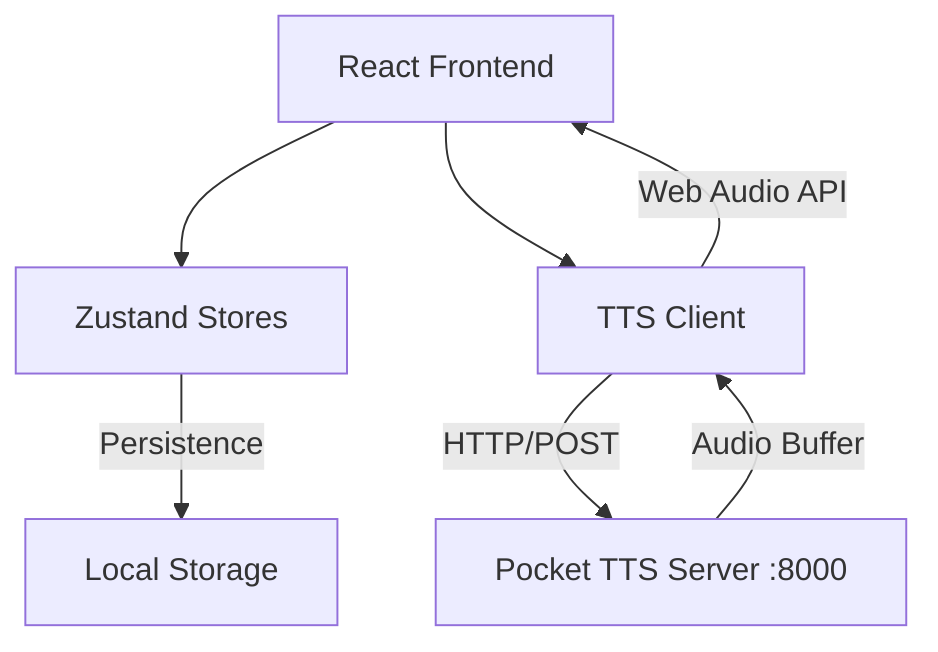
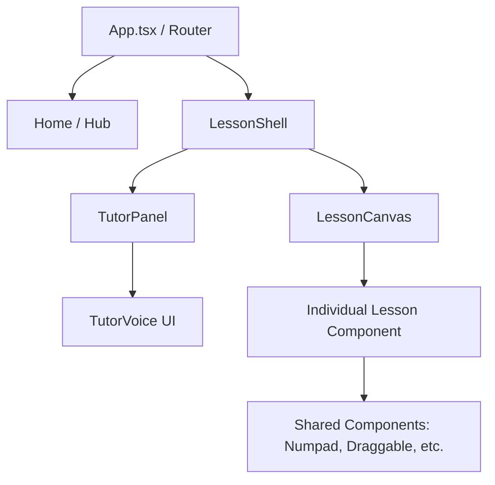

# Architecture Documentation — Math-Tutor

## 1. System Overview
Math-Tutor is a client-heavy React application that communicates with a local Pocket TTS server for audio synthesis.

## 2. Component Hierarchy
The application uses a **Shell-Canvas-Panel** pattern to maintain UI consistency across 36 lessons.

## 3. Data Flow
### 3.1 Adaptive Difficulty
1.  **Lesson Component** emits `onCorrect` or `onWrong` via a feedback prop.
2.  **`useAdaptiveDifficulty` Hook** catches this and calls `recordAttempt()` in the store.
3.  **`useDifficultyStore`** updates the rolling window, calculates accuracy, and adjusts the `level` (1-5).
4.  **Math Generators** use the updated `level` to generate the next problem's range.

### 3.2 Voice Feedback Loop
1.  **`LessonShell`** detects a change in `feedback` state.
2.  It calls `voice.speak('onCorrect' | 'onWrong')`.
3.  **`useTutorVoice`** hook:
    -   Starts a typewriter animation for the text.
    -   Requests audio from `ttsClient`.
    -   `ttsClient` checks cache, then fetches from server.
    -   Plays audio via Web Audio API.

## 4. State Management Units
- **`useProgressStore`**: Persistent curriculum progress (stars, scores).
- **`useDifficultyStore`**: Persistent skill level (1-5).
- **`useChildStore`**: Persistent user profile (name, avatar, age).
- **`useScoreStore`**: Volatile session metrics (points, streak).

## 5. Technology Choices
- **Framer Motion**: Standard for all layout transitions and micro-animations.
- **Zustand + Persist Middleware**: Simplified state compared to Redux, with built-in `localStorage` sync.
- **@dnd-kit**: Robust solution for complex drag-and-drop interactions in lessons.
