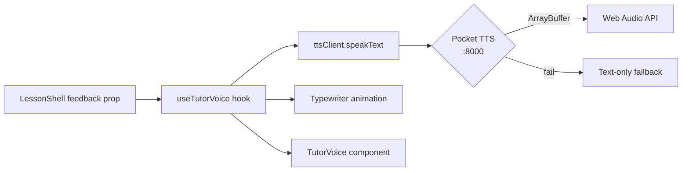

# Math-Tutor — Project Analysis Report

> Generated: 2026-03-09

---

## 1. Executive Summary

Math-Tutor is a **production-quality, client-side educational web app** targeting K1–K5 students (kindergarten through grade 5). It features **36 interactive math lessons** spread across 9 curriculum categories, an AI tutor voice powered by a local Pocket TTS server, adaptive difficulty, persistent progress tracking, and a polished dark-themed UI.

The project is well-structured, cleanly typed in TypeScript, and shows a high level of architectural maturity for a front-end-only app.

---

## 2. Tech Stack

| Layer | Technology |
|---|---|
| Framework | React 18 + TypeScript |
| Build | Vite 5 |
| Routing | React Router DOM v6 |
| Animations | Framer Motion 11 |
| State Management | Zustand 5 (4 stores) |
| Drag & Drop | @dnd-kit/core |
| Audio | Web Audio API (custom) |
| TTS Server | Pocket TTS (FastAPI/Uvicorn, `localhost:8000`) |
| Styling | Tailwind CSS 3 |
| Sound Effects | Howler.js |

---

## 3. Project Structure

```
src/
├── App.tsx                  # Router — 36 routes
├── main.tsx
├── screens/
│   ├── Home.tsx             # Landing / category hub (~29KB)
│   └── ComingSoon.tsx
├── categories/              # Lesson components (36 total)
│   ├── counting/            (4 lessons)
│   ├── place-value/         (4 lessons)
│   ├── addition/            (5 lessons)
│   ├── subtraction/         (5 lessons)
│   ├── multiplication/      (6 lessons)
│   ├── division/            (4 lessons)
│   ├── fractions/           (5 lessons)
│   ├── algebraic/           (4 lessons)
│   └── number-sense/        (3 lessons)
├── components/
│   ├── layout/
│   │   ├── LessonShell.tsx  # Master lesson wrapper
│   │   ├── LessonCanvas.tsx # Right-panel content area
│   │   └── TutorPanel.tsx   # Left-panel AI tutor
│   └── shared/
│       ├── TutorVoice.tsx   # Typewriter + audio indicator UI
│       ├── LessonComplete.tsx # End-of-lesson modal + stars
│       ├── Confetti.tsx
│       ├── DraggableTile.tsx
│       ├── NumberLine.tsx
│       ├── Numpad.tsx
│       ├── ProgressBar.tsx
│       ├── ScoreDisplay.tsx
│       └── AnimatedCounter.tsx
├── hooks/
│   ├── useTutorVoice.ts     # TTS + typewriter + hint system
│   ├── useAdaptiveDifficulty.ts
│   ├── useTimer.ts
│   └── useSound.ts
├── store/
│   ├── useProgressStore.ts  # Persisted lesson progress + stars
│   ├── useDifficultyStore.ts# Persisted adaptive difficulty level
│   ├── useScoreStore.ts     # Session score + streak (in-memory)
│   └── useChildStore.ts     # Persisted child profile
└── utils/
    ├── mathGenerators.ts    # Problem generators (all 4 ops)
    ├── lessonVoiceConfigs.ts# Voice instructions + hints (36 lessons)
    ├── ttsClient.ts         # TTS HTTP client + Web Audio + cache
    ├── animationPresets.ts
    └── problemValidator.ts
```

---

## 4. Lesson Inventory (36 Lessons)

| Category | Lessons |
|---|---|
| **Counting** | DotCounter, NumberLineWalker, Comparison, SkipCounting |
| **Place Value** | DotBuilder, ExpandedForm, Hieroglyphs, Rounding |
| **Addition** | ObjectCombining, NumberBonds, MakingTen, ColumnAddition, AdditionWordProblems |
| **Subtraction** | ObjectTakeaway, NumberLineJumpsBack, TenFrame, ColumnSubtraction, MissingNumberSubtraction |
| **Multiplication** | EqualGroups, ArrayBuilder, SquareNumbers, TimesTableMap, Flashcards, MagicSquare |
| **Division** | DotGrouper, FairShare, RepeatedSubtraction, FactFamily |
| **Fractions** | GridPainter, FractionComparator, FractionNumberLine, EquivalentFractions, MixedNumbers |
| **Algebraic Thinking** | PatternSequencer, BalanceScale, FunctionMachine, MissingNumberEq |
| **Number Sense** | Primes, NegativeNumbers, WordProblems |

---

## 5. Architecture Deep-Dive

### 5.1 Lesson Layout Pattern
Every lesson follows the same composition pattern:
```
LessonShell (25% left panel + 75% right panel)
  ├── TutorPanel → TutorVoice  (left — AI instructor)
  └── LessonCanvas              (right — actual lesson UI)
        └── {lesson-specific children}
```

`LessonShell` is the smart orchestrator — it owns the voice lifecycle (speaks instruction on mount, reacts to `feedback` prop changes to trigger `onCorrect`/`onWrong`/hint events). Individual lesson components only pass `feedback='correct'|'wrong'` up as a prop.

### 5.2 Voice / TTS System



Key features:
- **Audio cache** — `Map<text, ArrayBuffer>` avoids repeat fetches for the same phrase
- **Health check** — polls TTS server every 10s; gracefully degrades to text-only
- **Hint system** — wrong answers trigger `offerHint()`, presenting a 💡 button; accepted hints are spoken and animated
- **Randomized feedback pool** — 5–7 messages per event type (`onCorrect`, `onWrong`, etc.)

### 5.3 State Management (4 Zustand Stores)

| Store | Persisted | Purpose |
|---|---|---|
| `useProgressStore` | ✅ | Stars (1–3), best scores, attempt counts, per-lesson history |
| `useDifficultyStore` | ✅ | Level (1–5), rolling 10-attempt accuracy window, auto-adjustment |
| `useChildStore` | ✅ | Name, avatar emoji, age group (k1–k5) |
| `useScoreStore` | ❌ | Session points, streak (doubles at 5+), correct/wrong counts |

### 5.4 Adaptive Difficulty
The `useDifficultyStore` implements a classic **sliding-window accuracy** algorithm:
- Tracks last 10 attempts
- Levels **up** if accuracy ≥ 85% over ≥5 attempts
- Levels **down** if accuracy < 60%
- Drives `mathGenerators` which have 5 number ranges per operation (e.g. addition: `[1,5] → [1,10] → [1,20] → [10,50] → [10,99]`)

---

## 6. Strengths

- ✅ **Complete curriculum** — 36 lessons covering K–5 math, well-organized by category
- ✅ **Excellent UX architecture** — single `LessonShell` pattern means all lessons look/feel consistent with zero duplication of layout code
- ✅ **TTS graceful degradation** — the app fully works without the TTS server (text-only mode)
- ✅ **Adaptive difficulty** — real sliding-window algorithm, not just a static level picker
- ✅ **Persisted progress** — stars, best scores, and difficulty survive page refreshes via `localStorage`
- ✅ **Type safety** — fully typed with TypeScript interfaces (`LessonVoiceConfig`, `LessonProgress`, etc.)
- ✅ **Polished animations** — Framer Motion used tastefully and consistently (typewriter cursor, hint pop-in, lesson-complete spring animation)
- ✅ **Audio cache** — prevents re-fetching TTS audio for repeated phrases
- ✅ **Voice configs centralized** — all 36 lesson instructions + hints live in one `lessonVoiceConfigs.ts` file, easy to update

---

## 7. Improvement Opportunities

### 🔴 High Priority

| Issue | Details |
|---|---|
| **No tests** | Zero test files exist. Critical for an educational product — at minimum, `mathGenerators.ts` and `problemValidator.ts` are pure functions that should have unit tests |
| **`Home.tsx` is a monolith** | At ~29KB, the home screen is very large. Should be broken into `CategoryCard`, `LessonCard`, `HeroSection` sub-components |
| **`useScoreStore` not connected to `useProgressStore`** | Session score and session streak are separate from persisted progress; `addPoints` in `useProgressStore` exists but `useScoreStore` doesn't call it — stars and lifetime points are disconnected |
| **No category unlock gating** | All 9 categories start as `unlocked: true`. The `unlockCategory` action exists but is never called — the progression system is unused |

### 🟡 Medium Priority

| Issue | Details |
|---|---|
| **`useAdaptiveDifficulty` underused** | The hook exists but not all lessons consume it — some lessons likely use hardcoded difficulty ranges |
| **No loading state for TTS** | When TTS generates audio, there's no spinner or delay indicator — the voice indicator only appears once audio starts playing |
| **`LessonShell.useVoice` unusual pattern** | Attaching `useTutorVoice` as a static property on a component (`LessonShell.useVoice = useTutorVoice`) is non-idiomatic — just import the hook directly |
| **`ComingSoon.tsx` screen unused** | The route exists in the screens folder but no route in `App.tsx` points to it |
| **No error boundary** | If a lesson component crashes, the entire app breaks. React error boundaries per lesson would isolate failures |

### 🟢 Nice-to-Have

| Suggestion |
|---|
| Dark/light theme toggle |
| Parent dashboard to view child progress |
| Localization / Arabic support (given the developer's other projects) |
| PWA support (offline via service worker — makes sense for a kids app) |
| Keyboard navigation for accessibility |
| A `useTimer` hook exists but timer-gated challenges (speed mode) aren't visible in the UI |

---

## 8. File Size Overview

| File | Size | Note |
|---|---|---|
| `Home.tsx` | 29.1 KB | Needs splitting |
| `lessonVoiceConfigs.ts` | 11.2 KB | Acceptable (data file) |
| `TimesTableMap.tsx` | 11.9 KB | Complex lesson — ok |
| `SkipCounting.tsx` | 12.4 KB | Complex lesson — ok |
| `GridPainter.tsx` | 13.6 KB | Complex lesson — ok |
| `ttsClient.ts` | 3.4 KB | Clean and focused |
| `LessonShell.tsx` | 4.7 KB | Clean |
| `useTutorVoice.ts` | 3.6 KB | Clean |

---

## 9. Summary Scorecard

| Dimension | Score | Notes |
|---|---|---|
| **Code Quality** | 8/10 | Clean, typed, consistent patterns |
| **Architecture** | 8/10 | Great layout abstraction; minor issues (Home monolith) |
| **Feature Completeness** | 7/10 | All lessons built; progression/unlock system unused |
| **Testing** | 0/10 | No tests at all |
| **UX/Design** | 9/10 | Polished dark UI, smooth animations, great voice system |
| **Scalability** | 7/10 | Adding a new lesson is easy; adding categories requires App.tsx edits |

**Overall: Strong foundation. The core product is excellent. Main gaps are testing, wiring up the progression system, and splitting `Home.tsx`.**
